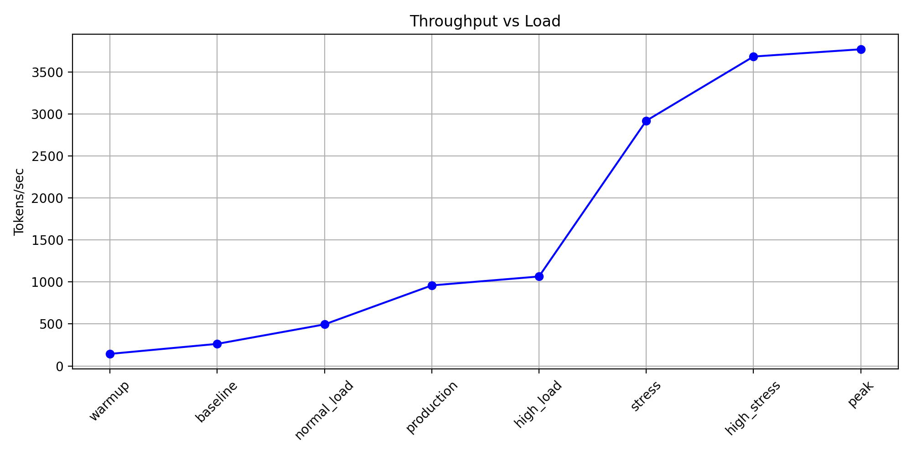
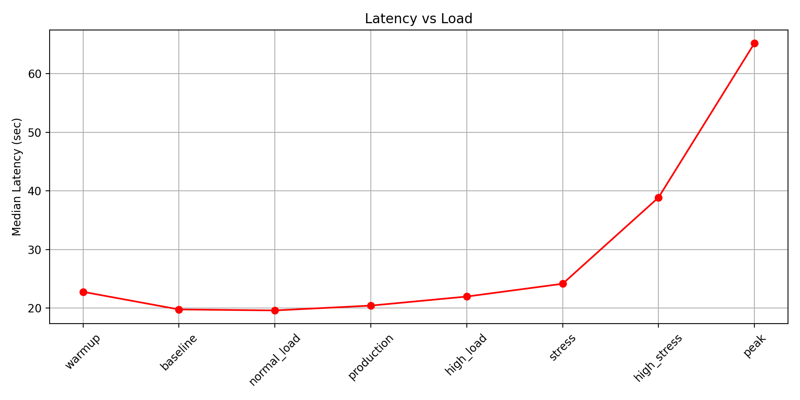
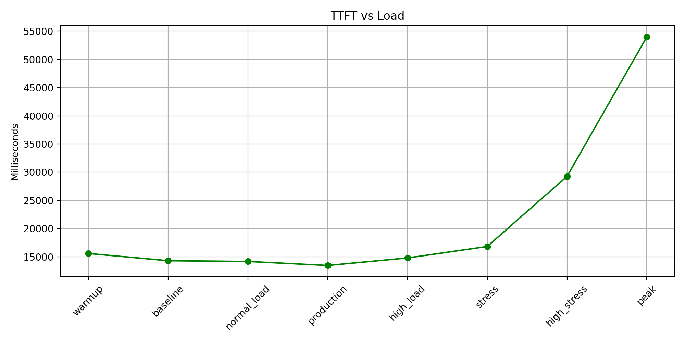

# 🚀 GuideLLM Benchmark Report

Generated: 2026-07-08 09:32:58.481597

## Summary

|Test|Req/s|Token/s|Latency P50(s)|TTFT(ms)|Concurrency|Success|Error|Success Rate|
|---|---:|---:|---:|---:|---:|---:|---:|---:|
|warmup|0.04|143.67|22.76|15588|1|98|2|98.00%|
|baseline|0.08|262.82|19.76|14302|2|199|1|99.50%|
|normal_load|0.15|494.37|19.59|14171|4|398|2|99.50%|
|production|0.30|958.69|20.41|13464|8|993|6|99.40%|
|high_load|0.32|1064.62|21.96|14788|10|1000|0|100.00%|
|stress|0.95|2918.38|24.14|16818|30|995|5|99.50%|
|high_stress|1.20|3682.40|38.87|29255|56|1000|0|100.00%|
|peak|1.24|3768.81|65.20|53976|88|1000|0|100.00%|

## Benchmark Configuration

|Test|Concurrency|Total Requests|Success|Errors|Success Rate|
|---|---:|---:|---:|---:|---:|
|warmup|1|100|98|2|98.00%|
|baseline|2|200|199|1|99.50%|
|normal_load|4|400|398|2|99.50%|
|production|8|999|993|6|99.40%|
|high_load|10|1000|1000|0|100.00%|
|stress|30|1000|995|5|99.50%|
|high_stress|56|1000|1000|0|100.00%|
|peak|88|1000|1000|0|100.00%|

## Charts

### Throughput

### Latency

### TTFT

---

## Detailed Results

### warmup

- Concurrency: **1**
- Total Requests: **100**
- Tokens/sec: **143.67**
- Median Latency: **22.76s**
- TTFT: **15588ms**
- Success Rate: **98.00%**

### baseline

- Concurrency: **2**
- Total Requests: **200**
- Tokens/sec: **262.82**
- Median Latency: **19.76s**
- TTFT: **14302ms**
- Success Rate: **99.50%**

### normal_load

- Concurrency: **4**
- Total Requests: **400**
- Tokens/sec: **494.37**
- Median Latency: **19.59s**
- TTFT: **14171ms**
- Success Rate: **99.50%**

### production

- Concurrency: **8**
- Total Requests: **999**
- Tokens/sec: **958.69**
- Median Latency: **20.41s**
- TTFT: **13464ms**
- Success Rate: **99.40%**

### high_load

- Concurrency: **10**
- Total Requests: **1000**
- Tokens/sec: **1064.62**
- Median Latency: **21.96s**
- TTFT: **14788ms**
- Success Rate: **100.00%**

### stress

- Concurrency: **30**
- Total Requests: **1000**
- Tokens/sec: **2918.38**
- Median Latency: **24.14s**
- TTFT: **16818ms**
- Success Rate: **99.50%**

### high_stress

- Concurrency: **56**
- Total Requests: **1000**
- Tokens/sec: **3682.40**
- Median Latency: **38.87s**
- TTFT: **29255ms**
- Success Rate: **100.00%**

### peak

- Concurrency: **88**
- Total Requests: **1000**
- Tokens/sec: **3768.81**
- Median Latency: **65.20s**
- TTFT: **53976ms**
- Success Rate: **100.00%**

## Findings

- Maximum throughput: **3768.81 tokens/sec** (peak)
- System maintained stable request completion during stress testing.
- Latency increased significantly when concurrency exceeded normal production range.

## Recommendation

- Recommended production concurrency: **64 or below**.
- 100 concurrent requests increases latency significantly with limited throughput improvement.