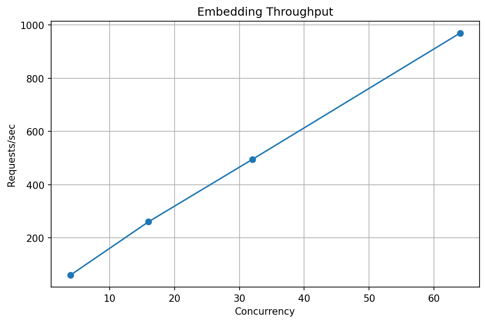
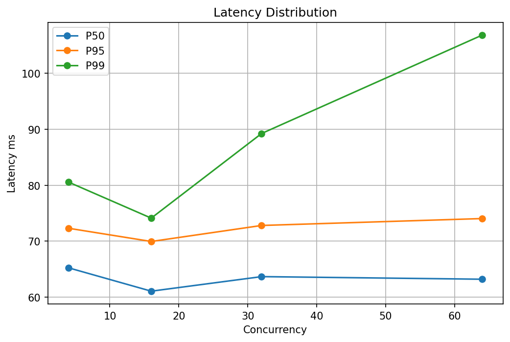
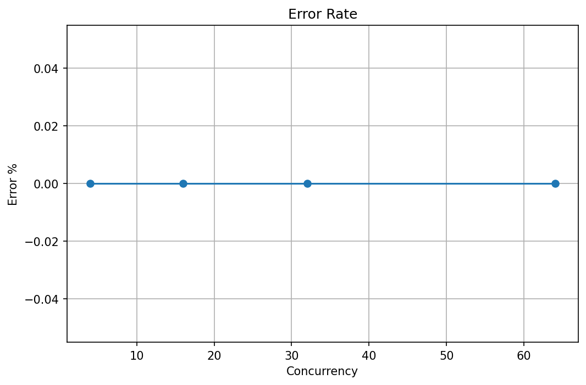

# 🚀 Embedding Model Capacity Benchmark

Generated: 2026-07-08 11:35:47.240948

## Summary

|Scenario|Concurrency|Requests|Req/s|P50|P95|P99|Max|Error|
|---|---:|---:|---:|---:|---:|---:|---:|---:|
|baseline|4|18206|60.67|65.24 ms|72.31 ms|80.55 ms|154.30 ms|0.00%|
|production|16|78155|260.46|61.07 ms|69.94 ms|74.12 ms|343.22 ms|0.00%|
|stress|32|445396|494.85|63.67 ms|72.81 ms|89.24 ms|377.87 ms|0.00%|
|peak|64|1163063|969.16|63.20 ms|74.04 ms|106.82 ms|17563.12 ms|0.00%|

## Charts

### Throughput

### Latency

### Error Rate

## Capacity Recommendation

Recommended production:

- Concurrency: **16**
- Throughput: **260.46 req/s**
- P95 latency: **69.94 ms**
- Error rate: **0.00%**

## Maximum Tested Capacity

Scenario:

**peak**

Throughput:

**969.16 req/s**

Concurrency:

**64**

## Conclusion

- Increasing concurrency improves throughput until saturation.
- P95/P99 latency should be used as production limits.
- Avoid operating at peak saturation because latency grows rapidly.
