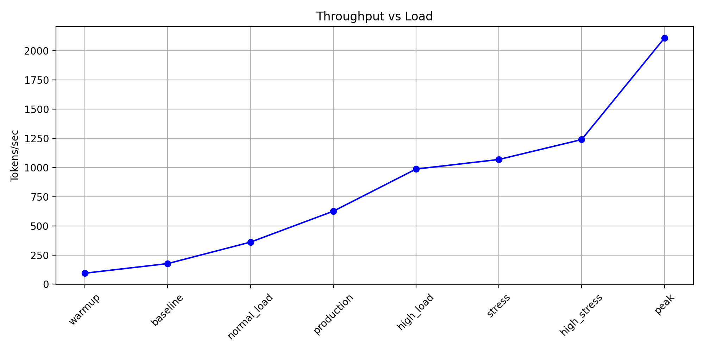
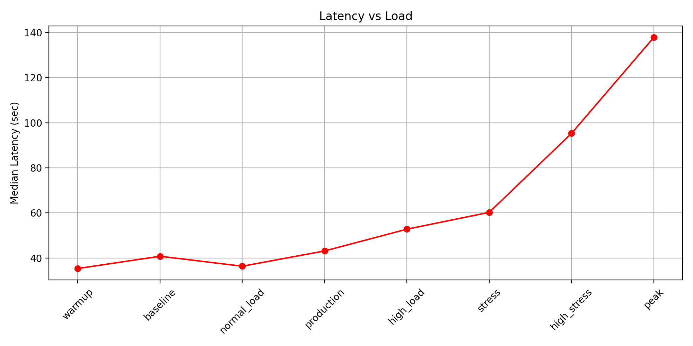
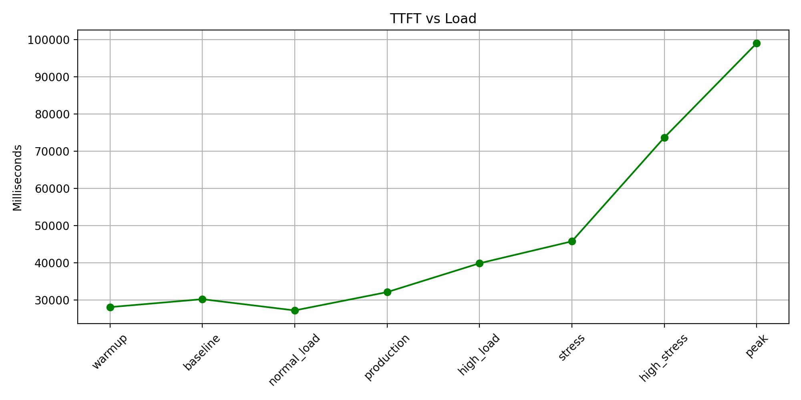

# 🚀 GuideLLM Benchmark Report

Generated: 2026-07-08 09:40:45.014116

## Summary

|Test|Req/s|Token/s|Latency P50(s)|TTFT(ms)|Concurrency|Success|Error|Success Rate|
|---|---:|---:|---:|---:|---:|---:|---:|---:|
|warmup|0.02|94.71|35.35|28126|1|98|2|98.00%|
|baseline|0.03|176.65|40.78|30265|2|198|1|99.50%|
|normal_load|0.09|360.44|36.37|27241|4|394|17|99.66%|
|production|0.16|625.08|43.14|32162|8|996|3|99.70%|
|high_load|0.23|986.03|52.79|39912|15|992|7|99.30%|
|stress|0.25|1067.92|60.26|45806|19|999|0|100.00%|
|high_stress|0.28|1238.44|95.28|73695|33|999|0|100.00%|
|peak|0.53|2107.52|137.84|99048|83|999|0|100.00%|

## Benchmark Configuration

|Test|Concurrency|Total Requests|Success|Errors|Success Rate|
|---|---:|---:|---:|---:|---:|
|warmup|1|100|98|2|98.00%|
|baseline|2|199|198|1|99.50%|
|normal_load|4|399|394|17|99.66%|
|production|8|999|996|3|99.70%|
|high_load|15|999|992|7|99.30%|
|stress|19|999|999|0|100.00%|
|high_stress|33|999|999|0|100.00%|
|peak|83|999|999|0|100.00%|

## Charts

### Throughput

### Latency

### TTFT

---

## Detailed Results

### warmup

- Concurrency: **1**
- Total Requests: **100**
- Tokens/sec: **94.71**
- Median Latency: **35.35s**
- TTFT: **28126ms**
- Success Rate: **98.00%**

### baseline

- Concurrency: **2**
- Total Requests: **199**
- Tokens/sec: **176.65**
- Median Latency: **40.78s**
- TTFT: **30265ms**
- Success Rate: **99.50%**

### normal_load

- Concurrency: **4**
- Total Requests: **4999**
- Tokens/sec: **360.44**
- Median Latency: **36.37s**
- TTFT: **27241ms**
- Success Rate: **99.66%**

### production

- Concurrency: **8**
- Total Requests: **999**
- Tokens/sec: **625.08**
- Median Latency: **43.14s**
- TTFT: **32162ms**
- Success Rate: **99.70%**

### high_load

- Concurrency: **15**
- Total Requests: **999**
- Tokens/sec: **986.03**
- Median Latency: **52.79s**
- TTFT: **39912ms**
- Success Rate: **99.30%**

### stress

- Concurrency: **19**
- Total Requests: **999**
- Tokens/sec: **1067.92**
- Median Latency: **60.26s**
- TTFT: **45806ms**
- Success Rate: **100.00%**

### high_stress

- Concurrency: **33**
- Total Requests: **999**
- Tokens/sec: **1238.44**
- Median Latency: **95.28s**
- TTFT: **73695ms**
- Success Rate: **100.00%**

### peak

- Concurrency: **83**
- Total Requests: **999**
- Tokens/sec: **2107.52**
- Median Latency: **137.84s**
- TTFT: **99048ms**
- Success Rate: **100.00%**

## Findings

- Maximum throughput: **2107.52 tokens/sec** (peak)
- System maintained stable request completion during stress testing.
- Latency increased significantly when concurrency exceeded normal production range.

## Recommendation

- Recommended production concurrency: **64 or below**.
- 100 concurrent requests increases latency significantly with limited throughput improvement.
