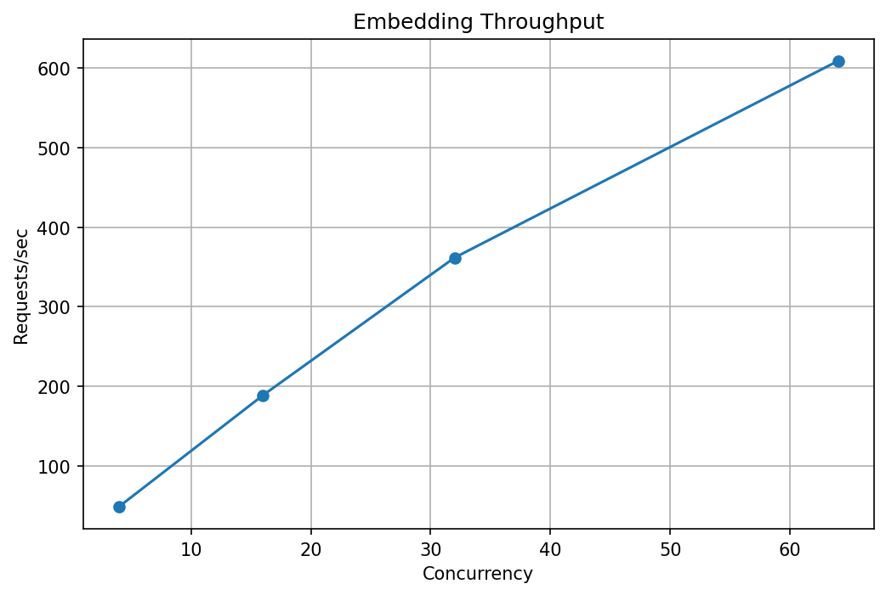
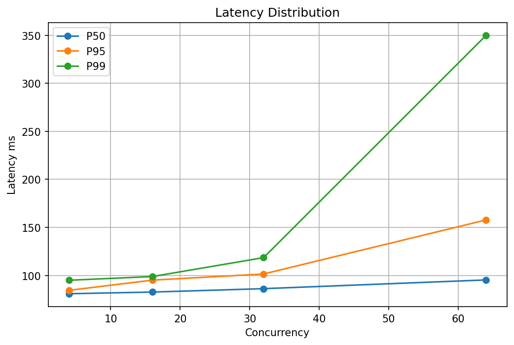

# 🚀 Embedding Model Capacity Benchmark

Generated: 2026-07-08 10:10:33.230028

## Summary

|Scenario|Concurrency|Requests|Req/s|P50|P95|P99|Max|Error|
|---|---:|---:|---:|---:|---:|---:|---:|---:|
|baseline|4|14685|48.94|80.92 ms|84.48 ms|94.96 ms|213.68 ms|0.00%|
|production|16|56632|188.72|82.66 ms|95.07 ms|98.82 ms|565.26 ms|0.00%|
|stress|32|325619|361.77|86.20 ms|101.50 ms|118.52 ms|1350.36 ms|0.00%|
|peak|64|730787|608.92|95.28 ms|157.78 ms|350.00 ms|2466.74 ms|0.00%|

## Charts

### Throughput

### Latency

### Error Rate

## Capacity Recommendation

Recommended production:

- Concurrency: **16**
- Throughput: **188.72 req/s**
- P95 latency: **95.07 ms**
- Error rate: **0.00%**

## Maximum Tested Capacity

Scenario:

**peak**

Throughput:

**608.92 req/s**

Concurrency:

**64**

## Conclusion

- Increasing concurrency improves throughput until saturation.
- P95/P99 latency should be used as production limits.
- Avoid operating at peak saturation because latency grows rapidly.
